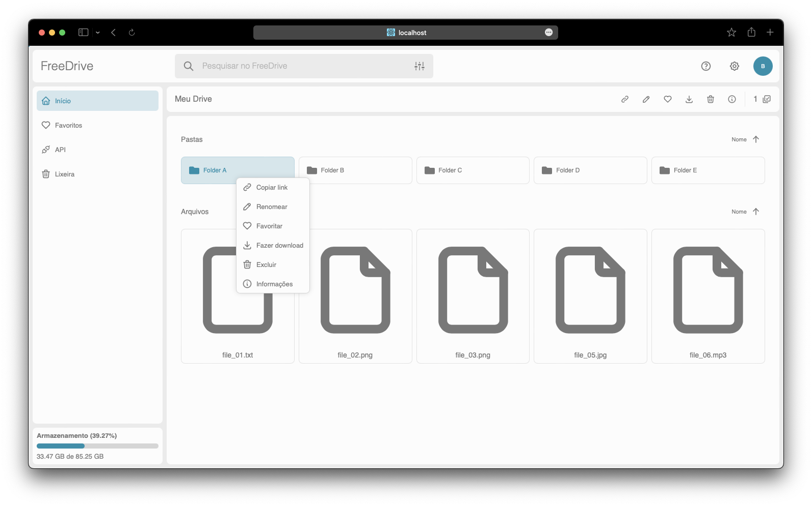

# FreeDrive
Gerenciador de arquivos em nuvem inspirado no Google Drive, construído em React + NodeJS.

<h2>Funcionalidades</h2>

<h3>Upload de arquivos</h3>

Ao clicar com botão direito do mouse, o menu de contexto permitirá o upload de um ou vários arquivos.

<h3>Criar pastas</h3>

É possível criar pastas para organizar seus arquivos dentro do sistema.

<h3>Renomear arquivos e pastas</h3>

Existe a possibilidade de renomear arquivos e pastas.

<h3>Favoritar arquivos e pastas</h3>

Há uma página específica, na qual vão todos os arquivos ou pastas favoritados.

<h3>Deletar arquivos e pastas</h3>

É possível mover arquivos ou pastas para a lixeira e deleta-los permanentemente.

<h3>Baixar arquivos</h3>

É possível baixar um ou vários arquivos, sendo que se for mais de um, será gerado um arquivo compactado contendo todos os arquivos selecionados.

<h3>Tema escuro</h3>

É o que não podia faltar, um tema escuro :)

